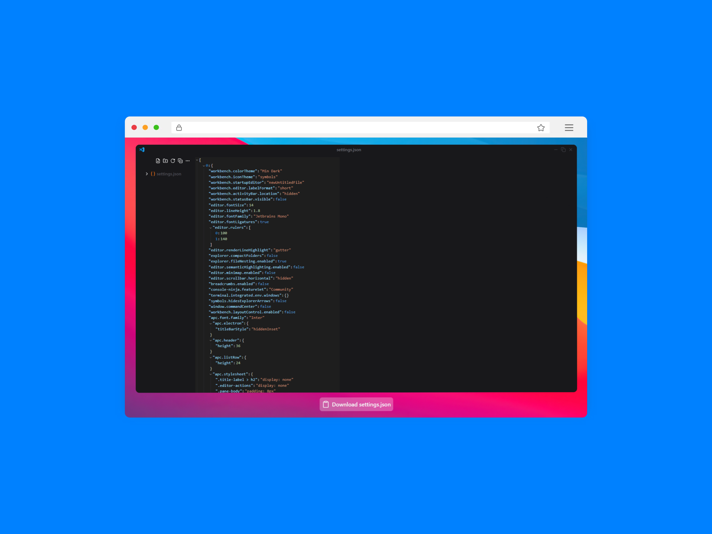

<h1 align="center"> My Visual Studio Settings </h1>

  <a href="#-tecnologias">Tecnologias</a>&nbsp;&nbsp;&nbsp;|&nbsp;&nbsp;&nbsp;
  <a href="#-projeto">Projeto</a>&nbsp;&nbsp;&nbsp;|&nbsp;&nbsp;&nbsp;
  <a href="#-para-rodar">Para rodar</a>&nbsp;&nbsp;&nbsp;|&nbsp;&nbsp;&nbsp;
  <a href="#memo-licença">Licença</a>

  

 

## 🚀 Tecnologias

Esse projeto foi desenvolvido com as seguintes tecnologias:

### Front-end:
- ReactJS 
- Typescript 
- TailwindCSS 
          

### Versionamento:
- Git    
- Github 
          

## 💻 Projeto

Esse projeto tem como intuito, desafiar minhas habilidades no front-end, e ao mesmo tempo compartilhar as minhas configurações do Visual Studio Code

## 🔧 Para rodar

1. Basta fazer o download do arquivo ``settings.json`` no site
2. Instalar a extensão **APC Customize UI++**

## :memo: Licença

Esse projeto está sob a licença MIT.